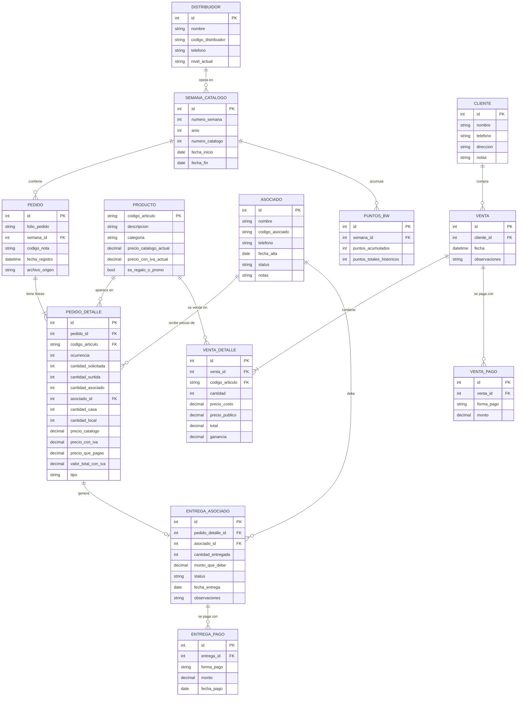

# Diseño de base de datos — Sistema completo de distribución Betterware

## 1. Cómo funciona el negocio (resumen para fundamentar el diseño)

Una distribución Betterware tiene dos tipos de participantes con lógicas de negocio distintas, y el sistema necesita reflejar esa diferencia:

- **La Distribuidora (tú):** compra directo a Betterware con descuento (12–16% según tu nivel: Base/Líder/Master), recibe el pedido físico, y de ahí reparte: una parte se la entregan a sus Asociados (que pagan su propio precio con su propio descuento, ~24%), y otra parte se queda como stock propio para vender ella misma a clientes finales — esto último es exactamente lo que pediste monitorear aparte ("ventas del distribuidor que no son de asociados").
- **Los Asociados:** son personas de tu equipo que ordenan a través de tu cuenta/distribución, pagan su propio pedido (con su descuento), y no forman parte de tu stock ni de tus ventas — son cuentas por cobrar independientes.
- El negocio corre en **ciclos de catálogo** (típicamente 6 semanas, antes variaba entre 4–6), y dentro de cada catálogo hay **semanas** individuales (las que ya vemos en tus PDFs: "Semana 27 -2026").
- Cada semana/catálogo acumulas **Puntos Betterware (PB)**, que dependen de tus compras y las de tu grupo, y que se canjean por premios. Los asociados necesitan una compra mínima por catálogo (~$500-700) para no perder sus puntos; las distribuidoras necesitan clasificar como mínimo "Base" cada catálogo.
- Tu **nivel de distribución** (Concesionaria/Base/Líder/Master) se recalcula cada catálogo según el monto de venta grupal, y de ahí sale tu % de comisión.
- Los productos tienen **garantía** (21 días general, 90 días si trae el ícono de garantía extendida), y hay categorías especiales como "producto de regalo", "última llamada" y "hasta agotar existencias" que ya vimos en tus PDFs y que no cuentan para garantía de surtido.

Todo esto ya lo cubre en buena parte lo que construimos (Movimientos, Existencias, Ventas, Entregas Asociado, Directorio), pero le faltan piezas para ser un sistema "completo": ligar cada entrega a un Asociado específico (hoy es un bucket genérico), separar tus clientes finales de tus asociados, trackear semanas/catálogos y puntos, y permitir pagos divididos sin límite de 2.

---

## 2. Diagrama entidad-relación



---

## 3. Tablas y su justificación

### 3.1 `productos` (nueva — catálogo maestro)
Hoy la descripción y el precio de cada producto se repiten en cada línea de pedido. Separarlos evita inconsistencias (mismo código con distinta descripción por typo del PDF) y permite marcar productos de regalo/promo/última llamada para reportes y para excluirlos de reabastecimiento automático.

| Columna | Tipo | Notas |
|---|---|---|
| codigo_articulo | TEXT PK | código Betterware |
| descripcion | TEXT | |
| categoria | TEXT | cocina, baño, etc. (opcional) |
| precio_catalogo_actual | DECIMAL | referencia, no histórico |
| precio_con_iva_actual | DECIMAL | referencia, no histórico |
| es_regalo_o_promo | BOOLEAN | para excluir de reportes de reabasto |

### 3.2 `semana_catalogo` (nueva)
Trackea el ciclo de negocio real de Betterware (semana + catálogo de 6 semanas), habilitando reportes de "venta grupal semanal" para saber en qué nivel de comisión estás.

### 3.3 `asociados` (ampliación del directorio actual)
Se agregan `codigo_asociado`, `fecha_alta` y `status` (activo/inactivo) porque Betterware exige actividad mínima por catálogo para no perder puntos — esto te permite ver de un vistazo quién está en riesgo de "congelarse".

### 3.4 `clientes` (nueva — el monitoreo de ventas propias que pediste)
Hoy tus ventas directas no tienen un cliente identificado, solo el producto. Esta tabla te permite llevar CRM real de tus compradores finales (nombre, teléfono, notas) separado por completo de tus Asociados, que es justo la distinción que pediste.

### 3.5 `pedido` + `pedido_detalle` (= tu hoja actual "Movimientos", normalizada)
Se separa el encabezado (folio, semana) de las líneas (producto, cantidades). Se agrega `asociado_id` en el detalle: **hoy sabemos cuántas piezas se fueron a "Asociado" pero no a cuál** — este es el hueco más importante para un monitoreo de asociados real. Con este campo puedes saber cuánto le debe cada asociado específico, no solo un total genérico.

### 3.6 `entrega_asociado` + `entrega_pago` (reemplaza tu hoja "Entregas Asociado")
Se separan los pagos en su propia tabla en vez de columnas fijas "Forma de pago 1/2": así puedes registrar **cualquier cantidad de pagos parciales**, no solo dos, y queda un historial con fecha de cada abono.

### 3.7 `venta` + `venta_detalle` + `venta_pago` (reemplaza tu hoja "Ventas")
Se separan en 3 tablas para dos mejoras reales:
- **venta_detalle** permite que una sola venta incluya varios productos (una "canasta"), no solo uno como hoy.
- **venta_pago** da el mismo beneficio de pagos múltiples que a las entregas de asociado.
- **venta** se liga a `cliente_id`, habilitando reportes por cliente (quién te compra más, quién no ha vuelto, etc.)

### 3.8 `puntos_bw` (nueva)
Cada nota trae "Total PB acumulados al cierre de semana X" — capturarlo simplemente te da una gráfica de tu avance a premios sin tener que entrar a la app de Betterware a consultarlo.

### 3.9 `existencias` — se vuelve una **vista calculada**, no una tabla
Ya no necesita guardarse: piezas recibidas, vendidas y disponibles se calculan al vuelo desde `pedido_detalle` (Casa+Local), `venta_detalle` y `entrega_asociado`. Esto elimina el riesgo de que la tabla de existencias se desincronice de la realidad (el problema raíz de los bugs de fórmulas que tuvimos en Excel).

---

## 4. Recomendación técnica: migrar de Excel a SQLite

Excel fue perfecto para arrancar, pero un "sistema completo" con estas relaciones (pedidos → detalle → entregas → pagos, ventas → detalle → pagos, todo ligado a productos/asociados/clientes) ya es más de lo que una hoja de cálculo puede manejar de forma confiable — es exactamente el tipo de estructura para la que existen las bases de datos relacionales.

**Propuesta:** mover el almacenamiento a **SQLite** (un solo archivo `.db`, no requiere instalar un servidor, funciona igual de simple para tu usuaria final que el `.xlsx` actual) y mantener un botón "Exportar a Excel" para cuando quieras imprimir o compartir un reporte. Python tiene soporte nativo para SQLite (`sqlite3`), así que no se agregan dependencias nuevas.

**Plan de migración sugerido (por fases, sin perder nada de lo que ya tienes):**
1. Crear las tablas nuevas en SQLite y escribir un script que importe tu `inventario_betterware.xlsx` actual (Movimientos → pedido/pedido_detalle, Ventas → venta/venta_detalle/venta_pago, Entregas Asociado → entrega_asociado/entrega_pago, Directorio → asociados).
2. Adaptar `inventario_core.py` para leer/escribir en SQLite en vez de pandas+openpyxl (la lógica de negocio, validaciones de stock, etc. se queda casi igual).
3. Agregar a la GUI: selector de Asociado al repartir en la vista previa (para llenar `asociado_id`), pantalla de "Clientes", y el detalle de semana/catálogo/puntos en el Dashboard.
4. Mantener el botón "Exportar a Excel" para reportes.

¿Quieres que empecemos por ahí — armo el script de migración y adapto `inventario_core.py` a SQLite manteniendo toda la funcionalidad actual?

---

## 5. Alternativa: diseño no relacional (NoSQL)

### 5.1 ¿Conviene aquí?

Antes del diseño, la pregunta honesta: **tus datos tienen relaciones fuertes** (un pedido tiene líneas, una línea puede generar una entrega, una entrega tiene pagos; un cliente tiene ventas, una venta tiene detalle y pagos) y necesitas cosas como "cuánto me debe en total este asociado" o "cuántas piezas tengo disponibles de este producto sumando todos los pedidos menos todas las ventas menos todas las entregas" — eso es exactamente lo que las bases relacionales resuelven bien con JOINs y lo que Mongo/NoSQL resuelven peor (hay que hacerlo a mano en el código).

Dicho esto, **sí es viable y tiene ventajas reales para tu caso**:
- Tu esquema ya cambia seguido en esta conversación (agregamos Asociado/Casa/Local, luego Entregas, luego Directorio...) — un documento sin esquema fijo tolera esos cambios sin tener que migrar columnas.
- Cada "cosa" que consultas normalmente la consultas completa de una vez (ej. "quiero ver todo sobre este asociado: sus entregas y sus pagos" o "todo sobre esta venta: sus productos y sus pagos") — eso es exactamente el patrón que favorece a un documento embebido, evitando el JOIN.
- Para un solo usuario en una laptop, sin necesitar servidor, la opción más práctica es **TinyDB** (Python puro, un solo archivo `.json`, cero instalación de servidor — el mismo tipo de simplicidad que SQLite pero en formato documento). MongoDB real necesitaría un servicio corriendo en la máquina, que es una complicación innecesaria para un solo usuario local.

### 5.2 Diseño de colecciones (documentos embebidos vs. referenciados)

Regla de diseño: **se embebe** lo que siempre se consulta junto (un pedido con sus líneas; un asociado con sus entregas y pagos; una venta con su detalle y sus pagos). **Se referencia** (por código, como string) lo que se comparte entre muchos documentos — el catálogo de productos.

```json
// Colección: productos
{
  "_id": "22428",
  "descripcion": "EXTENSIÓN FLEX",
  "categoria": "cocina",
  "es_regalo_o_promo": false
}

// Colección: pedidos  (= tu hoja Movimientos, embebiendo el detalle)
{
  "_id": "OV-0124962751",
  "semana": "27-2026",
  "fecha_registro": "2026-07-18",
  "archivo_origen": "20649437_Nota.pdf",
  "detalle": [
    {
      "codigo_articulo": "22428",
      "cantidad_surtida": 2,
      "cantidad_asociado": 0,
      "asociado_id": null,
      "cantidad_casa": 2,
      "cantidad_local": 0,
      "precio_con_iva": 129.00,
      "precio_que_pagas": 211.56,
      "tipo": "Normal (con descuento)"
    }
  ]
}

// Colección: asociados (embebe sus entregas y los pagos de cada entrega)
{
  "_id": "asoc_001",
  "nombre": "Juan Pérez",
  "telefono": "5512345678",
  "status": "activo",
  "entregas": [
    {
      "pedido_id": "OV-0124548837",
      "codigo_articulo": "26778",
      "cantidad": 1,
      "monto_que_debe": 327.18,
      "status": "Pagado",
      "pagos": [
        {"forma_pago": "Efectivo", "monto": 200, "fecha": "2026-07-20"},
        {"forma_pago": "Transferencia", "monto": 127.18, "fecha": "2026-07-21"}
      ]
    }
  ]
}

// Colección: clientes (embebe sus ventas, cada venta embebe detalle y pagos)
{
  "_id": "cli_001",
  "nombre": "Ana Torres",
  "telefono": "5512345678",
  "ventas": [
    {
      "fecha": "2026-07-18",
      "detalle": [
        {"codigo_articulo": "22428", "cantidad": 1, "precio_costo": 105.78, "precio_publico": 180, "ganancia": 74.22}
      ],
      "pagos": [
        {"forma_pago": "Efectivo", "monto": 180}
      ]
    }
  ]
}
```

### 5.3 Lo que se complica (y cómo se resuelve)

- **Existencias/stock disponible por producto:** ya no sale de un JOIN; el programa recorre en Python todos los `pedidos.detalle`, todas las `ventas` embebidas en `clientes`, y todas las `entregas` embebidas en `asociados`, sumando por `codigo_articulo`. Es exactamente el mismo cálculo que ya hace `inventario_core.py` hoy con pandas — el código cambia poco, solo cambia de dónde saca los datos.
- **Validar que un producto exista antes de usarlo:** en SQL lo garantiza una foreign key; aquí hay que validarlo a mano en el código antes de guardar (ya lo hacemos así, de hecho, porque Excel tampoco tiene foreign keys reales).
- **Reportes tipo "todos los pedidos de la semana 27, sin importar el asociado":** en un documento por asociado esto obliga a recorrer todos los asociados. Por eso los **pedidos** se quedan como su propia colección (no embebidos dentro de asociados), porque ese es un patrón de consulta distinto (por semana/folio, no por asociado).

### 5.4 Recomendación

Si te preocupa que seguiremos ajustando el esquema seguido (como ha pasado en esta conversación) y quieres la menor fricción posible para seguir agregando campos, **TinyDB es una alternativa razonable y la construiría con gusto**. Si lo que te importa es tener reportes confiables tipo "cuánto vendí, cuánto debo, cuánto tengo" sin duplicar lógica de cálculo a mano, **SQLite sigue siendo la opción más sólida** para este caso concreto, porque tus datos son más relacionales que documentales por naturaleza (todo se conecta con todo: producto↔pedido↔asociado↔pago).

Dime cuál prefieres y empiezo con el script de migración correspondiente.

---

## 6. Alternativa: plataforma web con Firebase

Esto ya es una decisión distinta a relacional-vs-documento: es **local vs. web**. Cambia el tipo de programa por completo (deja de ser un `.exe` de escritorio y se vuelve una app en el navegador), así que vale la pena ver primero si el cambio te conviene antes del diseño técnico.

### 6.1 Qué ganas y qué cuesta

**Ganas:**
- Acceso desde cualquier dispositivo (celular, laptop, tablet) sin instalar nada, con tu sesión.
- Sincronización en tiempo real: si registras una venta desde el celular, el Dashboard de la laptop se actualiza solo.
- Podrías, si algún día quieres, dar acceso limitado a un Asociado para que vea solo su propio saldo (con reglas de seguridad).
- Ya no dependes de "generar el .exe" ni de que la persona tenga Python — solo un link.

**Cuesta:**
- Necesitas internet siempre (hoy tu app funciona sin conexión).
- Es una reescritura completa de la interfaz: tkinter no sirve en un navegador: se necesita HTML/JS (o React) para el frontend.
- Firebase tiene un plan gratuito (Spark) generoso para un solo usuario, pero las Cloud Functions (necesarias para procesar PDFs en el servidor) requieren el plan de pago (Blaze) — aunque para tu volumen de uso el costo real sería mínimo, unos cuantos pesos al mes o incluso $0 dentro de la cuota gratuita de Blaze.

### 6.2 Arquitectura propuesta

| Pieza | Servicio Firebase | Para qué |
|---|---|---|
| Login (solo tú, o tú + asociados con acceso limitado) | **Firebase Authentication** | proteger tus datos |
| Guardar PDFs subidos | **Cloud Storage** | el PDF se sube ahí antes de procesarse |
| Procesar el PDF (extraer productos) | **Cloud Functions** (Python) | reutiliza casi todo tu `inventario_core.py` actual (pdfplumber corre en Python en el servidor) |
| Guardar pedidos, ventas, asociados, clientes | **Firestore** (base de datos) | el motor de datos |
| La interfaz que usas día a día | **Firebase Hosting** + una web (React o HTML simple) | reemplaza la ventana de tkinter |

Flujo de carga de PDF: subes el archivo → una Cloud Function lo procesa (misma lógica que ya tenemos) y lo deja en una colección "borradores" → la web te muestra la vista previa editable (igual que hoy) → al confirmar, un Cloud Function mueve los datos a las colecciones finales, ya validado.

### 6.3 Diseño de datos en Firestore (ajustando la respuesta anterior a las reglas propias de Firestore)

Firestore es documento como TinyDB, pero con dos diferencias importantes que cambian el diseño:
1. **Un documento no debe crecer sin límite** (límite duro de 1 MB, y en la práctica es mala práctica meter arrays que crecen para siempre). Por eso, lo que en la respuesta anterior embebíamos como array (entregas de un asociado, ventas de un cliente) aquí se vuelve **subcolección**, no un array dentro del documento.
2. **No hay JOINs ni agregaciones baratas.** Sumar "cuánto me debe este asociado" recorriendo su subcolección de entregas en cada consulta es lento y caro a escala. La solución estándar en Firestore es mantener un **campo acumulado** en el documento padre (ej. `saldo_pendiente`) que se actualiza con una transacción cada vez que se agrega o cambia un pago — igual que ya calculamos "Piezas disponibles" pero ahora lo guardamos, en vez de recalcularlo cada vez.

```
/productos/{codigo_articulo}
    descripcion, categoria, es_regalo_o_promo

/existencias/{codigo_articulo}          ← documento "resumen", se actualiza con transacciones
    piezas_recibidas, piezas_vendidas, piezas_disponibles, precio_unitario_costo

/pedidos/{pedido_id}
    folio, semana, fecha_registro
    /pedidos/{pedido_id}/detalle/{detalle_id}       ← subcolección
        codigo_articulo, cantidad_surtida, cantidad_asociado, asociado_id,
        cantidad_casa, cantidad_local, precio_que_pagas, tipo

/asociados/{asociado_id}
    nombre, telefono, status, saldo_pendiente        ← campo acumulado
    /asociados/{asociado_id}/entregas/{entrega_id}   ← subcolección
        codigo_articulo, cantidad, monto_que_debe, status
        /entregas/{entrega_id}/pagos/{pago_id}       ← subcolección
            forma_pago, monto, fecha

/clientes/{cliente_id}
    nombre, telefono, total_comprado                 ← campo acumulado
    /clientes/{cliente_id}/ventas/{venta_id}         ← subcolección
        fecha, detalle: [ {codigo, cantidad, precio_publico, ganancia} ],  ← array OK aqui (acotado, una venta no crece)
        pagos: [ {forma_pago, monto} ]                                     ← array OK aqui (acotado, máx. unos cuantos pagos)

/semanas_catalogo/{semana_id}
    numero_semana, puntos_bw_acumulados
```

Nota la regla: dentro de **una** venta o **una** entrega, el detalle/pagos sí se quedan como array embebido porque son acotados (una venta no va a tener 500 productos ni 500 pagos). Lo que se vuelve subcolección es la lista de ventas/entregas en sí, porque esa sí crece indefinidamente con el tiempo.

### 6.4 Seguridad

Con Firebase, la app web habla directo con Firestore (no necesitas programar un backend tradicional para el CRUD básico), así que la seguridad vive en **reglas de Firestore**, por ejemplo:

```
match /asociados/{id} {
  allow read, write: if request.auth.uid == "tu-uid-de-distribuidora";
}
```

Si más adelante quieres que un Asociado vea su propio saldo desde su celular, se ajustaría la regla para permitirle leer (no escribir) solo su propio documento.

### 6.5 Mi recomendación honesta

Si tu prioridad es **dejar de depender de instalar Python/generar el .exe** y poder ver tu negocio desde el celular, Firebase vale la pena y lo armo con gusto. Si tu prioridad es **la funcionalidad ya construida funcionando rápido y sin depender de internet**, seguir con SQLite local es más simple y barato de mantener — y siempre podemos migrar a Firebase después, porque el diseño de datos (arriba) es prácticamente el mismo que ya hicimos para TinyDB, solo reacomodado en subcolecciones.

¿Quieres que empecemos por el lado web con Firebase, o prefieres que primero quede sólido en SQLite/TinyDB de escritorio y migramos después?
